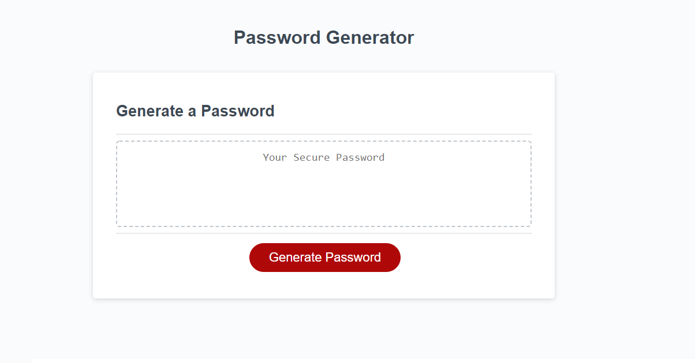
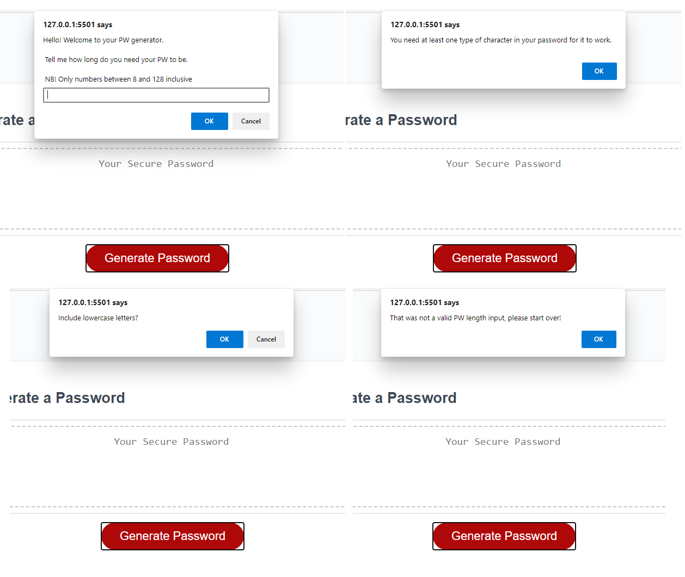
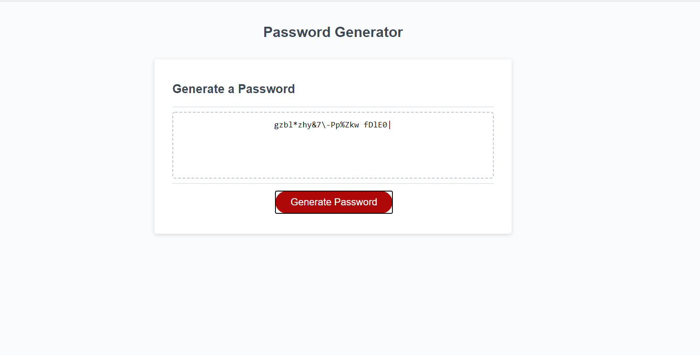

# Password generator

Generates a strong password based on user criteria. Below is the use story and acceptance criteria presented by the client.
The [live version of the page](https://maria-helbling.github.io/password_generator/) can be found here.

## User Story

```
AS AN employee with access to sensitive data
I WANT to randomly generate a password that meets certain criteria
SO THAT I can create a strong password that provides greater security
```

## Acceptance Criteria

```
GIVEN I need a new, secure password
WHEN I click the button to generate a password
THEN I am presented with a series of prompts for password criteria
WHEN prompted for password criteria
THEN I select which criteria to include in the password
WHEN prompted for the length of the password
THEN I choose a length of at least 8 characters and no more than 128 characters
WHEN prompted for character types to include in the password
THEN I choose lowercase, uppercase, numeric, and/or special characters
WHEN I answer each prompt
THEN my input should be validated and at least one character type should be selected
WHEN all prompts are answered
THEN a password is generated that matches the selected criteria
WHEN the password is generated
THEN the password is either displayed in an alert or written to the page
```
## Final product
Using javascript the application generates a unique random password based on acceptance criteria above.

Site view before password generates:



Prompt examples:



Password generated view:



## Setup
To clone the repo:

```
git clone https://github.com/maria-helbling/password_generator.git
```
## Credits
The code base and styling for basic site was provided by client.

## License
Built by Maria Helbling This application is released under [MIT](/license.txt) license.

## Contributing
To contribute to this application, create a pull request. Here are the steps needed for doing that:

- Fork the repo
- Create a feature branch (git checkout -b NAME-HERE)
- Commit your new feature (git commit -m 'Add some feature')
- Push your branch (git push)
- Create a new Pull Request

Following a code review, your feature will be merged.